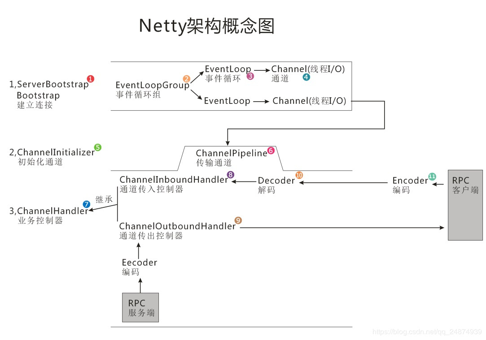
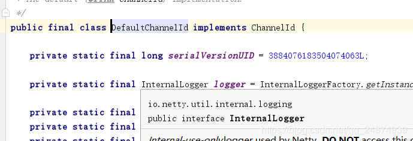

# websocketWithNetty
基于netty搭建websocket服务器
> netty是由jboss提供的一款开源框架，常用于搭建RPC中的TCP服务器、websocket服务器，甚至是类似tomcat的web服务器，反正就是各种网络服务器，在处理高并发的项目中，有奇用！功能丰富且性能良好，基于java中NIO的二次封装，具有比原生NIO更好更稳健的体验。
## netty的核心架构



官网给出的底层示意图：


## 1.项目结构

一个普通的maven项目即可

 - 核心依赖：

```xml
<dependencies>
    <!--netty的依赖集合，都整合在一个依赖里面了-->
    <dependency>
        <groupId>io.netty</groupId>
        <artifactId>netty-all</artifactId>
        <version>4.1.6.Final</version>
    </dependency>
    <!--这里使用jackson反序列字节码-->
    <dependency>
        <groupId>com.fasterxml.jackson.core</groupId>
        <artifactId>jackson-databind</artifactId>
        <version>2.9.7</version>
    </dependency>
    <!--加入log4j 便于深入学习整合运行过程的一些细节-->
    <dependency>
        <groupId>log4j</groupId>
        <artifactId>log4j</artifactId>
        <version>1.2.17</version>
    </dependency>
</dependencies>
```
## 代码
1.启动类

```java
public class NioWebSocketServer {
    private final Logger logger=Logger.getLogger(this.getClass());
    private void init(){
        logger.info("正在启动websocket服务器");
        NioEventLoopGroup boss=new NioEventLoopGroup();
        NioEventLoopGroup work=new NioEventLoopGroup();
        try {
            ServerBootstrap bootstrap=new ServerBootstrap();
            bootstrap.group(boss,work);
            bootstrap.channel(NioServerSocketChannel.class);
            bootstrap.childHandler(new NioWebSocketChannelInitializer());
            Channel channel = bootstrap.bind(8081).sync().channel();
            logger.info("webSocket服务器启动成功："+channel);
            channel.closeFuture().sync();
        } catch (InterruptedException e) {
            e.printStackTrace();
            logger.info("运行出错："+e);
        }finally {
            boss.shutdownGracefully();
            work.shutdownGracefully();
            logger.info("websocket服务器已关闭");
        }
    }

    public static void main(String[] args) {
        new NioWebSocketServer().init();
    }
}

```
netty搭建的服务器基本上都是差不多的写法：

 - 绑定主线程组和工作线程组，这部分对应架构图中的事件循环组 
 - 只有服务器才需要绑定端口，客户端是绑定一个地址
   
 - 配置channel（数据通道）参数，重点就是`ChannelInitializer`的配置

 - 以异步的方式启动，最后是结束关闭两个线程组

 2.ChannelInitializer写法


```java
public class NioWebSocketChannelInitializer extends ChannelInitializer<SocketChannel> {
    @Override
    protected void initChannel(SocketChannel ch) {
        ch.pipeline().addLast("logging",new LoggingHandler("DEBUG"));//设置log监听器，并且日志级别为debug，方便观察运行流程
        ch.pipeline().addLast("http-codec",new HttpServerCodec());//设置解码器
        ch.pipeline().addLast("aggregator",new HttpObjectAggregator(65536));//聚合器，使用websocket会用到
        ch.pipeline().addLast("http-chunked",new ChunkedWriteHandler());//用于大数据的分区传输
        ch.pipeline().addLast("handler",new NioWebSocketHandler());//自定义的业务handler
    }
}
```
3.自定义的处理器**NioWebSocketHandler**

```java
public class NioWebSocketHandler extends SimpleChannelInboundHandler<Object> {

    private final Logger logger=Logger.getLogger(this.getClass());

    private WebSocketServerHandshaker handshaker;

    @Override
    protected void channelRead0(ChannelHandlerContext ctx, Object msg) throws Exception {
        logger.debug("收到消息："+msg);
        if (msg instanceof FullHttpRequest){
            //以http请求形式接入，但是走的是websocket
                handleHttpRequest(ctx, (FullHttpRequest) msg);
        }else if (msg instanceof  WebSocketFrame){
            //处理websocket客户端的消息
            handlerWebSocketFrame(ctx, (WebSocketFrame) msg);
        }
    }

    @Override
    public void channelActive(ChannelHandlerContext ctx) throws Exception {
        //添加连接
        logger.debug("客户端加入连接："+ctx.channel());
        ChannelSupervise.addChannel(ctx.channel());
    }

    @Override
    public void channelInactive(ChannelHandlerContext ctx) throws Exception {
        //断开连接
        logger.debug("客户端断开连接："+ctx.channel());
        ChannelSupervise.removeChannel(ctx.channel());
    }

    @Override
    public void channelReadComplete(ChannelHandlerContext ctx) throws Exception {
        ctx.flush();
    }
    private void handlerWebSocketFrame(ChannelHandlerContext ctx, WebSocketFrame frame){
        // 判断是否关闭链路的指令
        if (frame instanceof CloseWebSocketFrame) {
            handshaker.close(ctx.channel(), (CloseWebSocketFrame) frame.retain());
            return;
        }
        // 判断是否ping消息
        if (frame instanceof PingWebSocketFrame) {
            ctx.channel().write(
                    new PongWebSocketFrame(frame.content().retain()));
            return;
        }
        // 本例程仅支持文本消息，不支持二进制消息
        if (!(frame instanceof TextWebSocketFrame)) {
            logger.debug("本例程仅支持文本消息，不支持二进制消息");
            throw new UnsupportedOperationException(String.format(
                    "%s frame types not supported", frame.getClass().getName()));
        }
        // 返回应答消息
        String request = ((TextWebSocketFrame) frame).text();
        logger.debug("服务端收到：" + request);
        TextWebSocketFrame tws = new TextWebSocketFrame(new Date().toString()
                + ctx.channel().id() + "：" + request);
        // 群发
        ChannelSupervise.send2All(tws);
        // 返回【谁发的发给谁】
        // ctx.channel().writeAndFlush(tws);
    }
    /**
     * 唯一的一次http请求，用于创建websocket
     * */
    private void handleHttpRequest(ChannelHandlerContext ctx,
                                   FullHttpRequest req) {
        //要求Upgrade为websocket，过滤掉get/Post
        if (!req.decoderResult().isSuccess()
                || (!"websocket".equals(req.headers().get("Upgrade")))) {
            //若不是websocket方式，则创建BAD_REQUEST的req，返回给客户端
            sendHttpResponse(ctx, req, new DefaultFullHttpResponse(
                    HttpVersion.HTTP_1_1, HttpResponseStatus.BAD_REQUEST));
            return;
        }
        WebSocketServerHandshakerFactory wsFactory = new WebSocketServerHandshakerFactory(
                "ws://localhost:8081/websocket", null, false);
        handshaker = wsFactory.newHandshaker(req);
        if (handshaker == null) {
            WebSocketServerHandshakerFactory
                    .sendUnsupportedVersionResponse(ctx.channel());
        } else {
            handshaker.handshake(ctx.channel(), req);
        }
    }
    /**
     * 拒绝不合法的请求，并返回错误信息
     * */
    private static void sendHttpResponse(ChannelHandlerContext ctx,
                                         FullHttpRequest req, DefaultFullHttpResponse res) {
        // 返回应答给客户端
        if (res.status().code() != 200) {
            ByteBuf buf = Unpooled.copiedBuffer(res.status().toString(),
                    CharsetUtil.UTF_8);
            res.content().writeBytes(buf);
            buf.release();
        }
        ChannelFuture f = ctx.channel().writeAndFlush(res);
        // 如果是非Keep-Alive，关闭连接
        if (!isKeepAlive(req) || res.status().code() != 200) {
            f.addListener(ChannelFutureListener.CLOSE);
        }
    }
}
```
执行流程是：

 - web发起一次类似是http的请求，并在`channelRead0`方法中进行处理，并通过instanceof去判断帧对象是`FullHttpRequest`还是`WebSocketFrame`，建立连接是时候会是`FullHttpRequest`
 - 在`handleHttpRequest`方法中去创建websocket，首先是判断`Upgrade`是不是websocket协议，若不是则通过`sendHttpResponse`将错误信息返回给客户端，紧接着通过`WebSocketServerHandshakerFactory`创建socket对象并通过handshaker握手创建连接
 - 在连接创建好后的所以消息流动都是以`WebSocketFrame`来体现
 - 在`handlerWebSocketFrame`去处理消息，也可能是客户端发起的关闭指令，ping指令等等

 4.保存客户端的信息
 当有客户端连接时候会被`channelActive`监听到，当断开时会被`channelInactive`监听到，一般在这两个方法中去保存/移除客户端的通道信息，而通道信息保存在`ChannelSupervise`中：


```java
public class ChannelSupervise {
    private   static ChannelGroup GlobalGroup=new DefaultChannelGroup(GlobalEventExecutor.INSTANCE);
    private  static ConcurrentMap<String, ChannelId> ChannelMap=new ConcurrentHashMap();
    public  static void addChannel(Channel channel){
        GlobalGroup.add(channel);
        ChannelMap.put(channel.id().asShortText(),channel.id());
    }
    public static void removeChannel(Channel channel){
        GlobalGroup.remove(channel);
        ChannelMap.remove(channel.id().asShortText());
    }
    public static  Channel findChannel(String id){
        return GlobalGroup.find(ChannelMap.get(id));
    }
    public static void send2All(TextWebSocketFrame tws){
        GlobalGroup.writeAndFlush(tws);
    }
}
```
ChannelGroup是netty提供用于管理web于服务器建立的通道channel的，其本质是一个高度封装的set集合，在服务器广播消息时，可以直接通过它的writeAndFlush将消息发送给集合中的所有通道中去。但在查找某一个客户端的通道时候比较坑爹，必须通过channelId对象去查找，而channelId不能人为创建，所有必须通过map将channelId的字符串和channel保存起来。

 为什么不能人为创建channelId：
 1.channelId是实现类`DefaultChannelId`这一点可以通过debug它的find发现：
 
 而DefaultChannelId中不提供任何修改channelId的操作，并且由final修飾不能被继承：
 
而我们获取的字符串形式的channelId实际上是它创建时候通过一定的算法生成的。

> 想要获取channel信息还是老老实实的封装一个map去维护字符串形式的id于channel的对应关系吧。
## 测试运行
客户端代码，只需要javascript的内置对象websocket即可：

```javascript
var socket;
    
    
    if(!window.WebSocket){
   
        window.WebSocket = window.MozWebSocket;
    }
   
    if(window.WebSocket){
        socket = new WebSocket("ws://localhost:8081/websocket");
        
        socket.onmessage = function(event){
   
              var ta = document.getElementById('responseText');
              ta.value += event.data+"\r\n";
        };
   
        socket.onopen = function(event){
   
              var ta = document.getElementById('responseText');
              ta.value = "打开WebSoket 服务正常，浏览器支持WebSoket!"+"\r\n";
              
        };
   
        socket.onclose = function(event){
   
              var ta = document.getElementById('responseText');
              ta.value = "";
              ta.value = "WebSocket 关闭"+"\r\n";
        };
    }else{
          alert("您的浏览器不支持WebSocket协议！");
    }
   
    function send(message){
      if(!window.WebSocket){return;}
      if(socket.readyState == WebSocket.OPEN){
          socket.send(message);
      }else{
          alert("WebSocket 连接没有建立成功！");
      }
      
    }
```

> 给出一个websocket的参考API地址：https://developer.mozilla.org/zh-CN/docs/Web/API/WebSocket/WebSocket

当web通过websocket对象连接成功后后台代码：

```
GET /websocket HTTP/1.1
Host: localhost:8081
Connection: Upgrade
Pragma: no-cache
Cache-Control: no-cache
Upgrade: websocket
Origin: file://
Sec-WebSocket-Version: 13
User-Agent: Mozilla/5.0 (Windows NT 10.0; Win64; x64) AppleWebKit/537.36 (KHTML, like Gecko) Chrome/72.0.3626.109 Safari/537.36
Accept-Encoding: gzip, deflate, br
Accept-Language: zh-CN,zh;q=0.9
Sec-WebSocket-Key: nJizI32hwlBOiORpLJUTDA==
Sec-WebSocket-Extensions: permessage-deflate; client_max_window_bits
content-length: 0
```
主要是`Upgrade: websocket`。如果直接在浏览器输入http://localhost:8081/websocket

后台输出：

```
GET /favicon.ico HTTP/1.1
Host: localhost:8081
Connection: keep-alive
User-Agent: Mozilla/5.0 (Windows NT 10.0; Win64; x64) AppleWebKit/537.36 (KHTML, like Gecko) Chrome/72.0.3626.109 Safari/537.36
Accept: image/webp,image/apng,image/*,*/*;q=0.8
Referer: http://localhost:8081/websocket
Accept-Encoding: gzip, deflate, br
Accept-Language: zh-CN,zh;q=0.9
Cookie: Idea-8e0020a7=5b26e4b3-9f9e-43e0-9a47-308f93716d8a; Webstorm-c460d780=4381b95f-1a24-483f-a5cf-902eec88b795
content-length: 0
```
对比可以发现请求头中缺少很多websocket的内容
而浏览器相应到的bad reques对应`NioWebSocketHandler`的`sendHttpResponse`的最后一个参数：

发送消息后：

前端收到服务端推送的消息后：

前端需要在方法`websocket.onmessage=function(messageEvent){}`通过messageEvent.data捕获消息

> 代码下载地址：https://github.com/Siwash/websocketWithNetty


